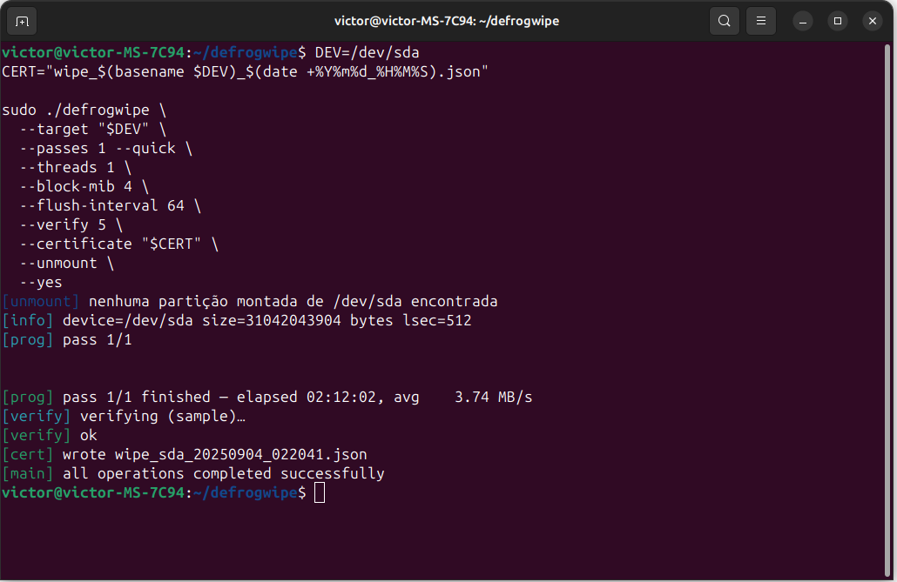

# DefrogWipe

> **Secure device wipe with verification & JSON certificate** — minimal, auditable, and script‑friendly.
>
> ⚠️ **DANGER: THIS PROGRAM DESTROYS DATA. DOUBLE‑CHECK YOUR TARGET.**


---

## Table of Contents

* [Overview](#overview)
* [Safety Warnings](#safety-warnings)
* [Features](#features)
* [Compatibility & Support](#compatibility--support)
* [Requirements](#requirements)
* [Download / Getting the Source](#download--getting-the-source)
* [Build](#build)

  * [Recommended build: Clang + LLD (small, hardened)](#recommended-build-clang--lld-small-hardened)
  * [Full build with native paths (NVMe/SCSI)](#full-build-with-native-paths-nvmescsi)
  * [GCC alternative](#gcc-alternative)
  * [Static builds (notes)](#static-builds-notes)
  * [Distro recipes](#distro-recipes)
* [Quick Start (TL;DR)](#quick-start-tldr)
* [Usage Walkthrough](#usage-walkthrough)
* [Command‑line Reference](#command-line-reference)
* [Examples](#examples)
* [Verification & JSON Certificate](#verification--json-certificate)

  * [Certificate schema](#certificate-schema)
  * [Example certificate (excerpt)](#example-certificate-excerpt)
  * [Independent audit (optional)](#independent-audit-optional)
* [Performance & Tuning](#performance--tuning)
* [How it works (internals)](#how-it-works-internals)
* [Known limitations](#known-limitations)
* [Troubleshooting](#troubleshooting)
* [FAQ](#faq)
* [License](#license)
* [Credits](#credits)

---

## Overview

**DefrogWipe** is a Linux command‑line tool for securely wiping block devices with an emphasis on **verifiability** and **evidence**. It can:

* Overwrite the device’s **logical address space** (zeros by default; multi‑pass and DoD patterns available).
* Emit a **JSON certificate** containing randomly sampled offsets and their **BLAKE2b‑256** hashes.
* Perform **verification** after writing (sample‑based or full logical scan).
* Optionally use **native device operations** when compiled with the proper flags (e.g., NVMe Sanitize / Format / Write‑Zeroes, SCSI SANITIZE, kernel BLKDISCARD/BLKZEROOUT).
* Auto‑unmount partitions before writing.

The intended workflow is simple and auditable: **wipe → verify → store certificate → (optionally) independently audit.**

---

## Safety Warnings

* **Destructive**: All data on the target device will be lost. Always verify the correct node (e.g., `/dev/sda`, `/dev/nvme0n1`).
* Run as **root** (writing to raw block devices requires privileges).
* USB flash/SSDs have controller‑managed over‑provisioning and wear‑leveling. A software overwrite guarantees the **logical** space; it **cannot** guarantee erasure of vendor‑reserved regions. For maximum physical purge on NVMe, prefer **NVMe Sanitize/Format** (if supported by the drive/firmware).
* On laptops, ensure AC power and avoid sleep during long operations.
* Always keep backups and test on **non‑critical** devices first.

---

## Features

* Multi‑pass software writes (zeros by default; DoD 3‑pass / 7‑pass).
* Post‑write verification: **`--verify-full`** or sample‑based **`--verify N`** (see note in [FAQ](#faq)).
* **JSON certificate** with BLAKE2b‑256 of randomly sampled 4 KiB windows.
* Native fast paths (optional at build time): **NVMe Sanitize/Format/Write‑Zeroes**, **SCSI SANITIZE**, **BLKDISCARD/BLKZEROOUT**.
* Auto **unmount** of any mounted partitions on the target.
* Tunable I/O: **threads**, **block size**, **flush interval**.
* Utilities: **`--list`** to enumerate block devices, **`--test-all`** self‑test.
* Colorful one‑line **progress** with ETA, plus **flush spinner** proving I/O via `/proc/diskstats`.

---

## Compatibility & Support

* **OS**: Linux only (uses Linux ioctls & `/sys`); not supported on macOS/Windows. WSL raw‑device access is limited.
* **Architectures**: x86‑64 primarily; others likely fine with a modern toolchain and `libsodium`.
* **Root** required for wiping.
* **Devices**: SATA/SAS/NVMe/USB Mass Storage. Native paths require device + kernel support.

---

## Requirements

* **Compiler**: Clang ≥ 14 (recommended) or GCC ≥ 11.
* **Library**: [`libsodium`](https://libsodium.gitbook.io/doc/) (BLAKE2b hashing, secure memory, RNG).
* **Headers (optional)** for native paths:

  * NVMe ioctls: `<linux/nvme_ioctl.h>` (kernel headers).
  * SCSI SG ioctls: `<scsi/sg.h>` / `<scsi/scsi.h>` (e.g. `libsgutils2-dev`).

Ubuntu/Debian quick deps:

```bash
sudo apt update
sudo apt install -y clang lld libsodium-dev libsgutils2-dev build-essential
```

---

## Download / Getting the Source

Clone your repository (replace with your URL):

```bash
git clone https://github.com/<you>/defrogwipe.git
cd defrogwipe
```


---

## Build

### Recommended build: Clang + LLD (small, hardened)

```bash
clang++ -std=c++23 -Oz -DNDEBUG -D_FILE_OFFSET_BITS=64 -pipe \
  -fvisibility=hidden -ffunction-sections -fdata-sections \
  -fstack-protector-strong -fPIE -fno-plt -flto=thin -fuse-ld=lld \
  -Wl,--gc-sections -Wl,--icf=all -Wl,-s -Wl,-O2 -Wl,--as-needed \
  -Wl,-z,relro -Wl,-z,now -Wl,-z,noexecstack -pie \
  -pthread defrogwipe.cpp -lsodium -o defrogwipe
```

This produces a **minimal** binary using software writes + verification.

### Full build with native paths (NVMe/SCSI)

Enables NVMe & SCSI SANITIZE/Format/Write‑Zeroes when available.

```bash
clang++ -std=c++23 -Oz -DNDEBUG -D_FILE_OFFSET_BITS=64 -pipe \
  -DUSE_LIBNVME -DUSE_SG_IO \
  -fvisibility=hidden -ffunction-sections -fdata-sections \
  -fstack-protector-strong -fPIE -fno-plt -flto=thin -fuse-ld=lld \
  -Wl,--gc-sections -Wl,--icf=all -Wl,-s -Wl,-O2 -Wl,--as-needed \
  -Wl,-z,relro -Wl,-z,now -Wl,-z,noexecstack -pie \
  -pthread defrogwipe.cpp -lsodium -o defrogwipe
```

> These flags only **expose** native commands; your drive must support them. For NVMe admin ioctls you need recent kernel headers.

### GCC alternative

```bash
g++ -std=c++23 -O2 -pipe -march=native -mtune=native -flto -pthread \
  defrogwipe.cpp -lsodium -o defrogwipe
```

### Static builds (notes)

* Static `libsodium` may require distro‑specific packages. If fully static is not required, prefer dynamic linking.
* Native ioctls do **not** require extra libraries; you only need headers.

### Distro recipes

**Arch/Manjaro**

```bash
sudo pacman -S --needed clang lld libsodium
clang++ -std=c++23 -O2 defrogwipe.cpp -lsodium -o defrogwipe
```

**Fedora/RHEL**

```bash
sudo dnf install -y clang lld libsodium-devel sg3_utils-devel
clang++ -std=c++23 -O2 defrogwipe.cpp -lsodium -o defrogwipe
```

**Alpine**

```bash
sudo apk add build-base clang lld libsodium-dev linux-headers
clang++ -std=c++23 -O2 defrogwipe.cpp -lsodium -o defrogwipe
```

---

## Quick Start (TL;DR)

Identify your device and wipe once with sampling verification and a certificate:

```bash
DEV=/dev/sdX
CERT="wipe_$(basename $DEV)_$(date +%Y%m%d_%H%M%S).json"

sudo ./defrogwipe \
  --target "$DEV" \
  --passes 1 --quick \
  --threads 1 \
  --block-mib 4 \
  --flush-interval 64 \
  --verify 5 \
  --certificate "$CERT" \
  --unmount \
  --yes
```

If you need 100% logical verification:

```bash
sudo ./defrogwipe --target "$DEV" --passes 1 --quick --verify-full --yes
```

---

## Usage Walkthrough



1. **List devices** (optional):

```bash
sudo ./defrogwipe --list
```

This prints a table like: `NAME TYPE BUS SIZE LSEC PSEC ROT RM MODEL` for devices in `/sys/class/block`.

2. **Pick the correct target** (e.g., `/dev/sda`, `/dev/nvme0n1`).
   Use `lsblk -o NAME,SIZE,MODEL,TRAN,TYPE` and double‑check **you’re wiping the right device**.

3. **Run the wipe** with the flags you want (see [Examples](#examples)). The tool can auto‑unmount any mounted partitions when `--unmount` is used.

4. **Verification** runs after the last pass unless you used a DoD plan that ends with a non‑zero pattern. Use `--verify-full` for a complete logical scan.

5. **Certificate**: if `--certificate FILE` is provided, a JSON report is written with sampled offsets and their BLAKE2b‑256 hashes.

6. **Exit codes**: `0` success; `2` on error.

---

## Command‑line Reference

```
Usage: defrogwipe [--list] [--test-all] --target /dev/sdX [options]

Options:
  --passes N              number of passes (default 1)
  --quick                 write zeros (default)
  --verify N              verify by sampling N random 4KiB blocks (see FAQ)
  --verify-full           verify entire device (slow)
  --certificate FILE      write a JSON certificate with sampled hashes
  --threads N             number of threads (USB: default 1 if not specified)
  --block-mib N           block size in MiB (default 4; adjusted to logical sector)
  --flush-interval MiB    periodic flush every N MiB (default 0 = disabled)
  --unmount               unmount partitions of the target before writing
  --yes | --force         do not ask for confirmation

Native (build‑time optional; drive/firmware support required):
  --nvme-sanitize         issue NVMe Sanitize
  --nvme-format           issue NVMe Format NVM
  --nvme-write-zeroes     issue NVMe Write Zeroes / BLKZEROOUT
  --scsi-sanitize         issue SCSI SANITIZE
  --discard               issue kernel BLKDISCARD (range trim)

Patterns (multi‑pass DoD plans):
  --dod3                  DoD 5220.22‑M (3 passes): 0x00, 0xFF, random
  --dod7                  DoD 5220.22‑M (7 passes): 0xF6, 0x00, 0xFF, random, 0x00, 0xFF, random

Utilities:
  --list                  enumerate block devices
  --test-all              run self‑test (writes to a temp file only)
```

> **Heads‑up:** `--yes` is required; otherwise the program refuses to run (safety stop).

---

## Examples

### 1) One pass of zeros + sample verification + certificate (USB)

```bash
DEV=/dev/sdX
CERT="wipe_$(basename $DEV)_$(date +%Y%m%d_%H%M%S).json"

sudo ./defrogwipe \
  --target "$DEV" \
  --passes 1 --quick \
  --threads 1 \
  --block-mib 4 \
  --flush-interval 64 \
  --verify 5 \
  --certificate "$CERT" \
  --unmount \
  --yes
```

### 2) Stronger policy for flash/SSDs: random then zeros (two runs)

```bash
sudo ./defrogwipe --target /dev/sdX --dod3 --yes  # includes random
sudo ./defrogwipe --target /dev/sdX --passes 1 --quick --verify-full --yes
```

### 3) NVMe Sanitize (if supported by your NVMe drive)

```bash
sudo ./defrogwipe --target /dev/nvme0n1 --nvme-sanitize --yes
```

**Warning:** Native ops are performed internally by the device; software verification/certificates may not apply.

### 4) SCSI SANITIZE (enterprise disks)

```bash
sudo ./defrogwipe --target /dev/sdX --scsi-sanitize --yes
```

### 5) Kernel BLKDISCARD (trim) over the whole device

```bash
sudo ./defrogwipe --target /dev/sdX --discard --yes
```

### 6) Full logical verification only (no writing)

Use external commands in [Independent audit](#independent-audit-optional) to validate a prior wipe.

---

## Verification & JSON Certificate

After a software pass completes, verification proceeds as requested:

* **`--verify N`**: sample **N** random 4 KiB windows across the device.
* **`--verify-full`**: scan the entire logical space and ensure it’s all zeros.
* For **DoD** sequences, verification is skipped if the last pass is non‑zero.

If `--certificate FILE` is provided and the wipe was software‑based, DefrogWipe writes a JSON like:

### Certificate schema

```json
{
  "device": "string",               // e.g., "/dev/sda"
  "size": 31042043904,               // bytes
  "method": "software_write",       // native ops may omit certificate
  "passes": 1,
  "samples": [
    { "offset": 4046725120, "len": 4096, "blake2b256": "hex" }
  ]
}
```

### Example certificate (excerpt)

```json
{
  "device": "/dev/sda",
  "size": 31042043904,
  "method": "software_write",
  "passes": 1,
  "samples": [
    { "offset": 4046725120, "len": 4096, "blake2b256": "686ede9288c391e7e05026e56f2f91bfd879987a040ea98445dabc76f55b8e5f" },
    { "offset": 2149396480, "len": 4096, "blake2b256": "686ede9288c391e7e05026e56f2f91bfd879987a040ea98445dabc76f55b8e5f" }
  ]
}
```

### Independent audit (optional)

Validate a completed wipe without the program:

**1) Compare entire device vs `/dev/zero`**

```bash
DEV=/dev/sdX
sudo cmp -n $(blockdev --getsize64 "$DEV") "$DEV" /dev/zero && echo "All zero" || echo "Diff!"
```

**2) Inspect the first and last bytes**

```bash
DEV=/dev/sdX; SIZE=$(blockdev --getsize64 "$DEV")
sudo hexdump -C -n 64 "$DEV" | head -n2
sudo hexdump -C -n 64 -s $((SIZE-64)) "$DEV" | head -n2
```

**3) Sample 20 random 4 KiB windows and hash with BLAKE2b‑256**

```bash
DEV=/dev/sdX; SIZE=$(blockdev --getsize64 "$DEV")
for i in {1..20}; do
  OFF=$(( (RANDOM<<20) % (SIZE-4096) ))
  sudo dd if="$DEV" bs=4096 skip=$((OFF/4096)) count=1 iflag=direct status=none | \
  openssl dgst -blake2b256
done | sort -u
```

All lines should show the same hash for a zeroed block.

---

## Performance & Tuning

* **Threads (`--threads`)**: default is **1 on USB**; otherwise `std::thread::hardware_concurrency()`.
* **Block size (`--block-mib`)**: default **4 MiB**; automatically aligned to the logical sector size.
* **Flush interval (`--flush-interval`)**: default **0** (disabled). Setting, e.g., `64` enforces `fdatasync` every 64 MiB to bound data at risk on power loss.
* USB media often performs best with 1–2 threads and 1–4 MiB blocks. NVMe scales to more threads and larger blocks.
* The progress meter shows instantaneous & average throughput plus ETA; a separate sync spinner appears during flushes.

---

## How it works (internals)

* Uses **multi‑threaded writers** with aligned I/O. Each pass covers the full logical space.
* Hashing uses **libsodium** `crypto_generichash` (BLAKE2b‑256). Secure buffers are **mlock**’d where possible.
* `--test-all` runs a self‑test on a **temporary 32 MiB file**: one random pass + one zero pass.
* Device enumeration walks `/sys/class/block` and prints a concise table including sector sizes and rotational/removable flags. USB is detected from the canonical sysfs path containing `/usb`.
* Verification reads 4 KiB windows and checks for all‑zero content (or scans the entire device for `--verify-full`).
* Certificates store sampled offsets and hashes to support later audits.
* Signals `SIGINT/SIGTERM/SIGHUP` set a stop flag for cooperative shutdown.

---

## Known limitations

* Software overwrites cover the **logical** device only. Over‑provisioned/wear‑leveling areas are not directly accessible.
* On **DoD** sequences, verification of the final state is skipped if the last pass isn’t zeros.
* Native NVMe/SCSI operations may **not** generate certificates and may bypass software verification (the device performs the operation internally).
* Some kernels/distros may not expose `BLKDISCARD/BLKZEROOUT`; the program detects and reports failures.

---

## Troubleshooting

* **Permission denied** → run with `sudo`.
* **Device busy / mounted** → add `--unmount` or manually `umount /dev/sdX1`; check `lsblk`, `mount`, `fuser -vm /dev/sdX`.
* **Wrong device** → confirm with `lsblk -o NAME,SIZE,MODEL,TRAN,TYPE` before running.
* **Slow USB speeds** → try `--threads 1` and `--block-mib 1..4`; use USB‑3 ports and good cables; avoid hubs.
* **Verification fails** → ensure your final pass was zeros; if you ended with random (DoD), run a final zero pass and verify again.
* **`--nvme-*` not working** → your NVMe or kernel may not support the admin command; try software write instead.

---

## FAQ

**Does one pass suffice?**
For logical sanitization of modern drives, a single pass of zeros is typically adequate. Add a random pass first if you want a stronger policy for flash.

**Is this the same as NVMe Sanitize?**
No. Sanitize is executed by the drive’s firmware and may purge hidden areas. Use `--nvme-sanitize` if your hardware supports it.

**Can I get a certificate for native operations?**
Not currently. Certificates are produced for software writes.

**What exactly does `--verify N` mean?**
In **v0.x**, `N` is the **number of random 4 KiB samples** (not a percentage). The usage text may say “%” in some builds; this will be harmonized in a future release.

---

## License

MIT (or another permissive license of your choice).

---

## Credits

* **Víctor Duarte Melo (Porquinho)** — concept & implementation.
* **SapoGPT** — documentation & testing.

*Libertas per croack!*
